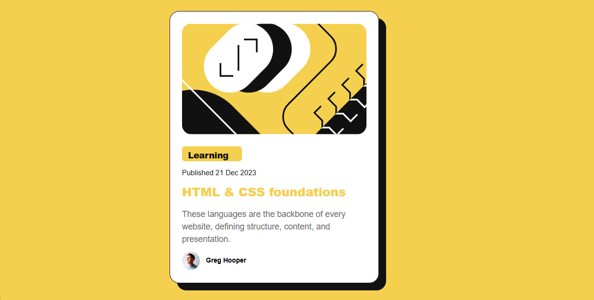

# 🚀 Frontend Mentor - Blog Preview Card



<p align="center">
  <a href="https://www.frontendmentor.io/challenges/blog-preview-card-ckPaj01IcS">
    
  </a>
  
  
</p>

---

## 📌 Sobre o projeto

Este projeto é uma solução para o desafio **Blog Preview Card** do Frontend Mentor.

O objetivo foi reproduzir fielmente o design proposto, aplicando boas práticas de desenvolvimento front-end e criando uma interface moderna, responsiva e visualmente consistente.

---

## 🎯 O desafio

Os usuários devem ser capazes de:

* Visualizar estados de **hover** e **focus** em todos os elementos interativos

---

## 🔗 Links

* 💻 Repositório: https://github.com/thalitasilva620/blog-preview-card
* 🌐 Deploy: https://[Vercel](https://blog-preview-card-esdlznfo2-thalitasilva620s-projects.vercel.app/)

---

## 🛠️ Tecnologias utilizadas

* HTML5 (semântico)
* CSS3
* Flexbox
* CSS Variables

---

## 📂 Estrutura do projeto

```bash
├── assets/
│   ├── fonts/
│   └── images/
│
├── src/
│   └── css/
│       ├── reset.css
│       ├── variables.css
│       └── style.css
│
├── index.html
└── README.md
```

---

## ✨ Funcionalidades

* 🎨 Layout fiel ao design
* 🖱️ Efeitos de hover no card e título
* 📱 Layout centralizado e responsivo
* 🎯 Uso de variáveis CSS para padronização

---

## 📚 Aprendizados

Durante o desenvolvimento deste projeto, pratiquei:

* Organização de código e estrutura de arquivos
* Uso de CSS Variables para consistência visual
* Aplicação de `box-shadow` para criar profundidade
* Atenção a detalhes de UI (pixel perfect)

---

## 🚧 Próximos passos

* Melhorar responsividade para diferentes breakpoints
* Adicionar animações mais suaves
* Evoluir para projetos com JavaScript e interatividade

---

## 🤖 Uso de IA

Durante o desenvolvimento, utilizei o ChatGPT como apoio para:

* Revisão de código
* Sugestões de melhorias
* Boas práticas de CSS
* Organização do README

---

## 👩‍💻 Autora

**Thalita Silva**

* GitHub: https://github.com/thalitasilva620

---

## 🙌 Agradecimentos

Desafio fornecido por:
👉 https://www.frontendmentor.io

---

## 📌 Status

✅ Projeto finalizado
